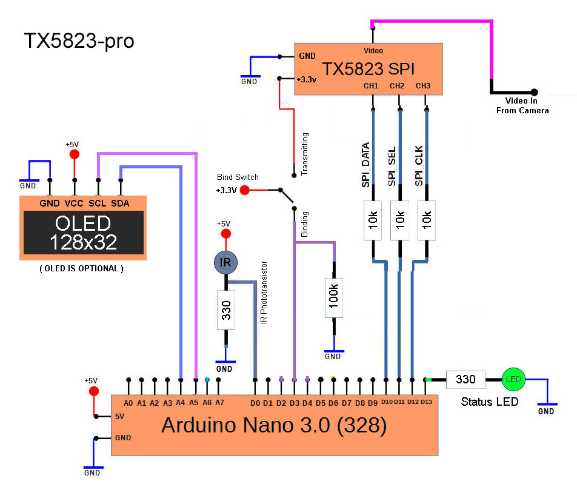

# tx5823-pro
The tx5823-pro transmitter module is configured via IR by the parent project [rx5808-pro-diversity](https://github.com/sheaivey/rx5808-pro-diversity/).

Here is a quick demo showing how it works with the parent project.

## Donations Welcome!
**Help fund more research and development into these great open source projects.**

Donations help show the developer your appreciation for all their hard work. A little goes a long way whether it is used for new hardware samples or better test equipment, you can be sure it will be put to good use.

## features
* **SPI** - controlled tx5823 module.
* **Channel & Call Sign Memory** - Retreive last received channel and call sign on bootup.
* **IR phototransistor** - For receiving serial payload.
* **Payload validation** - All bytes sent must pass final check sum.
* **Field Friendly** - Transmitter is off during bind mode to prevent noisy spectrum for other fliers.
* **Optional OLED display** - To show bind process and call sign.
* **Customizable Screens** - Create your own personalized screens.

## Usage
#### Binding
  * Transmitter is powered down
  * Status LED blinks 4 times per second
  * IR Phototransistor is listening for bytes
  * Status LED is solid for 5 seconds when payload is received.

#### Transmitting
  * Transmitter is powered on
  * Send New Channel to transmitter via SPI
  * Status LED blinks every second
  * IR Phototransistor is ignored

## Hardware
The schematic is quite simple and allows for an optional OLED display.

You will also need to modify the tx5823 module to receive SPI commands. See the
[SPI Modification](docs/tx5823-spi-mod.md) for details.

## License & Recognition
#### Recognition
* Original project idea of IR controlled video transmitter by Shea Ivey
* Schematics by Shea Ivey
* Source by Shea Ivey

#### License
The MIT License (MIT)

Permission is hereby granted, free of charge, to any person obtaining a copy of this software and associated documentation files (the "Software"), to deal in the Software without restriction, including without limitation the rights to use, copy, modify, merge, publish, distribute, sublicense, and/or sell copies of the Software, and to permit persons to whom the Software is furnished to do so, subject to the following conditions:

The above copyright notice and this permission notice shall be included in all copies or substantial portions of the Software.

THE SOFTWARE IS PROVIDED "AS IS", WITHOUT WARRANTY OF ANY KIND, EXPRESS OR IMPLIED, INCLUDING BUT NOT LIMITED TO THE WARRANTIES OF MERCHANTABILITY, FITNESS FOR A PARTICULAR PURPOSE AND NONINFRINGEMENT. IN NO EVENT SHALL THE AUTHORS OR COPYRIGHT HOLDERS BE LIABLE FOR ANY CLAIM, DAMAGES OR OTHER LIABILITY, WHETHER IN AN ACTION OF CONTRACT, TORT OR OTHERWISE, ARISING FROM, OUT OF OR IN CONNECTION WITH THE SOFTWARE OR THE USE OR OTHER DEALINGS IN THE SOFTWARE.
